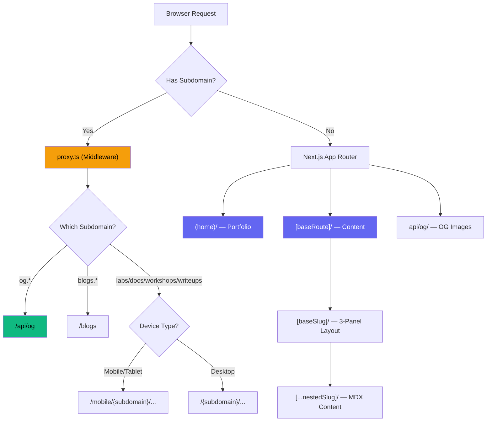
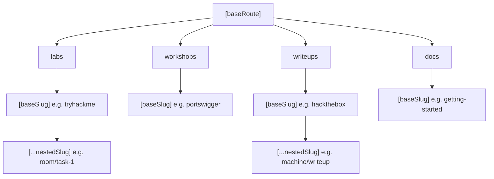
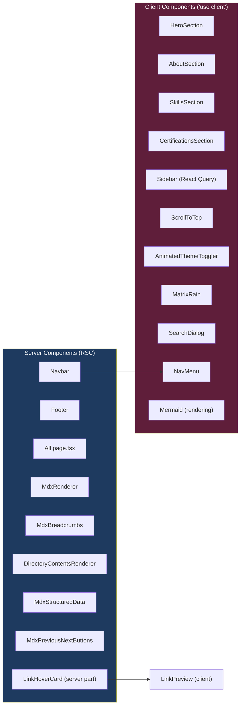
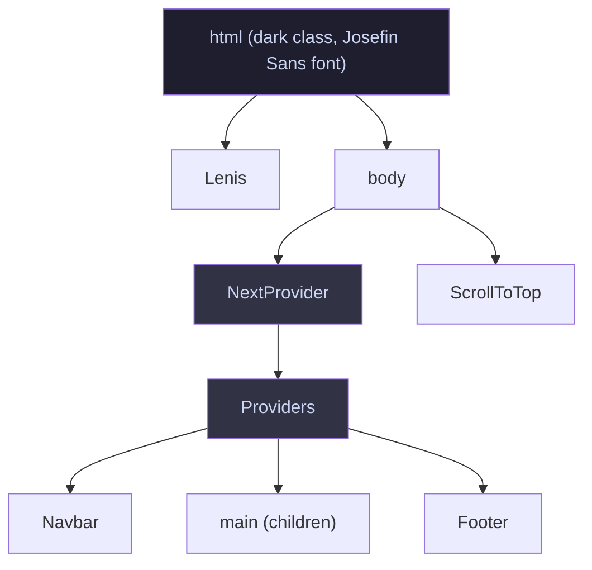

# 02 — Architecture

**Last Updated**: 2026-05-09

> **Note**: This documentation was generated with the assistance of AI and has been reviewed for accuracy.
> However, mistakes may exist. If you find any errors or inconsistencies, please [raise an issue](https://github.com/ThamizhiniyanCS/website/issues).

## System Architecture Overview



## Project File Structure

```
├── app/
│   ├── (home)/                    # Homepage sections
│   ├── blogs/                     # Blog pages (under construction)
│   ├── [baseRoute]/               # Content routes (labs, workshops, writeups, docs)
│   │   └── [baseSlug]/            # 3-panel layout (sidebar + content + TOC)
│   │       └── [...nestedSlug]/   # Deep nested MDX pages
│   ├── api/og/                    # OG image generation endpoint
│   ├── mobile/                    # Mobile rewrites (placeholder)
│   ├── layout.tsx                 # Root layout
│   ├── providers.tsx              # React Query provider
│   └── globals.css                # Tailwind v4 theme
├── actions/                       # Server Actions (CDN data fetching)
├── components/                    # UI components
├── mdx/                           # MDX processing pipeline
├── lib/                           # Config, constants, utilities
├── types/                         # TypeScript type definitions
├── schemas/                       # Zod validation schemas
├── hooks/                         # Custom React hooks
├── utils/                         # URL helpers, OG tokens
├── scripts/                       # Build scripts (Pagefind)
├── proxy.ts                       # Subdomain middleware
└── env.ts                         # Environment validation
```

## Dynamic Route Hierarchy



## Server / Client Component Boundary



## 3-Panel Content Layout


The 3-panel layout is implemented using `react-resizable-panels` in `[baseSlug]/layout.tsx`:
- **Left (order 1)**: Sidebar with React Query — base slug selector + collapsible directory tree
- **Center (order 2)**: Breadcrumbs + MDX content or directory listing (rendered by `page.tsx`)
- **Right (order 3)**: TOC with scroll spy from Fumadocs (rendered by `page.tsx`)
- All panels use `style={{ overflow: "visible" }}` for sticky positioning

## Root Layout Component Tree



## Related Docs

- [Routing & Middleware](./04-routing-and-middleware.md) — detailed subdomain routing
- [Components](./05-components.md) — individual component documentation
- [Data Flow](./08-data-flow.md) — server actions and caching
