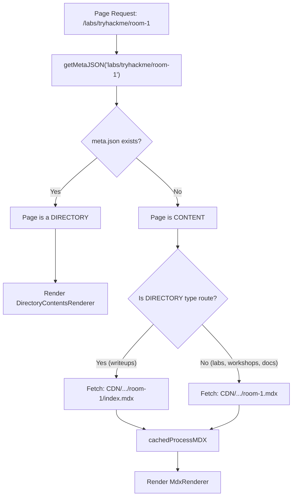

# 03 — Content System

**Last Updated**: 2026-05-09

> **Note**: This documentation was generated with the assistance of AI and has been reviewed for accuracy.
> However, mistakes may exist. If you find any errors or inconsistencies, please [raise an issue](https://github.com/ThamizhiniyanCS/website/issues).

## Overview

All content (MDX articles, metadata, images, videos) lives on an external **CDN** — this project is a rendering frontend only. There is no database, no CMS, and no server-side content storage. Content updates are pushed directly to the CDN.

## CDN Structure

```
CDN_BASE_URL/
├── labs/
│   ├── meta.json                 # Root metadata (lists base slugs)
│   └── tryhackme/
│       ├── meta.json             # Lists rooms/labs
│       └── room-name.mdx         # Flat MDX file (labs use .mdx suffix)
├── workshops/
│   ├── meta.json
│   └── portswigger/
│       ├── meta.json
│       └── lab-name.mdx
├── writeups/
│   ├── meta.json
│   └── hackthebox/
│       ├── meta.json
│       └── machine-name/
│           ├── meta.json
│           └── index.mdx         # Directory-style (writeups use /index.mdx)
├── docs/
│   ├── meta.json
│   └── topic/
│       ├── meta.json
│       └── article.mdx
├── socials.json                   # Social media links
├── my-resume.pdf                  # Resume download
└── pagefind/                      # Search index (built offline)
    └── pagefind.js
```

## meta.json Schema

Every directory on the CDN has a `meta.json` that describes its contents. The schema is validated with Zod:

```typescript
// schemas/meta-json.schema.ts
const MetaJsonChildSchema = z.discriminatedUnion("type", [
  z.object({
    type: z.literal("file"),
    slug: z.string(),
    title: z.string(),
    description: z.string(),
    filename: z.string(),
  }),
  z.object({
    type: z.literal("directory"),
    slug: z.string(),
    title: z.string(),
    group: z.boolean().optional(),
  }),
])

const MetaJsonSchema = z.object({
  root: z.boolean().optional(),
  slug: z.string(),
  title: z.string(),
  description: z.string().optional(),
  default: z.string().optional(),
  children: z.array(MetaJsonChildSchema),
})
```

### Example `meta.json`

```json
{
  "root": true,
  "slug": "labs",
  "title": "Labs",
  "description": "Cybersecurity lab walkthroughs",
  "children": [
    {
      "type": "directory",
      "slug": "tryhackme",
      "title": "TryHackMe"
    },
    {
      "type": "directory",
      "slug": "hackthebox",
      "title": "HackTheBox"
    }
  ]
}
```

### Child Types

| Type        | Fields                                  | Meaning                        |
| ----------- | --------------------------------------- | ------------------------------ |
| `file`      | `slug`, `title`, `description`, `filename` | Leaf content — renders MDX     |
| `directory` | `slug`, `title`, `group?`               | Container — has its own `meta.json` |

## Content Resolution Flow



## The `DIRECTORIES` Convention

The `DIRECTORIES` set in `lib/constants.ts` determines the MDX file naming convention:

```typescript
export const DIRECTORIES = new Set<string>(["writeups"])
```

| Route Type       | MDX File Location        | Example                                      |
| ---------------- | ------------------------ | -------------------------------------------- |
| **Default** (labs, workshops, docs) | `{slug}.mdx`  | `labs/tryhackme/room-name.mdx`               |
| **Directory** (writeups)           | `{slug}/index.mdx` | `writeups/hackthebox/machine-name/index.mdx` |

The directory convention allows writeups to have associated assets (images, files) co-located alongside the `index.mdx`.

## Content Types

| Subdomain   | Route        | File Convention | Description                    |
| ----------- | ------------ | --------------- | ------------------------------ |
| `labs.*`    | `/labs/...`  | `.mdx`          | Lab walkthroughs               |
| `workshops.*` | `/workshops/...` | `.mdx`    | Workshop guides                |
| `writeups.*` | `/writeups/...` | `/index.mdx` | CTF writeups (directory-style) |
| `docs.*`   | `/docs/...`  | `.mdx`          | Documentation articles         |
| `blogs.*`  | `/blogs`     | N/A             | Under construction             |

## Related Docs

- [Routing & Middleware](./04-routing-and-middleware.md) — how subdomains map to routes
- [MDX System](./06-mdx-system.md) — how MDX is processed and rendered
- [Data Flow](./08-data-flow.md) — server actions that fetch from CDN
