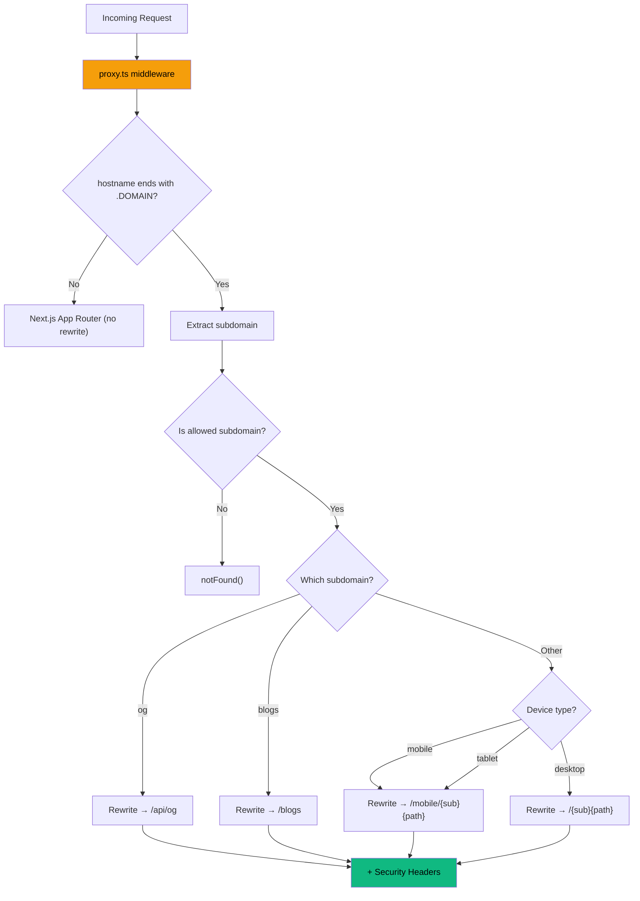

# 04 — Routing & Middleware

**Last Updated**: 2026-05-09

> **Note**: This documentation was generated with the assistance of AI and has been reviewed for accuracy.
> However, mistakes may exist. If you find any errors or inconsistencies, please [raise an issue](https://github.com/ThamizhiniyanCS/website/issues).

## Overview

The project uses **subdomain-based routing** via Next.js middleware (`proxy.ts`). Each content type has its own subdomain that gets rewritten to internal App Router paths.

## Allowed Subdomains

Defined in `lib/constants.ts`:

```typescript
export const ALLOWED_SUBDOMAINS = new Set<string>([
  "blogs",
  "docs",
  "labs",
  "og",
  "workshops",
  "writeups",
])

export const BASE_ROUTES = Array.from(ALLOWED_SUBDOMAINS).filter(
  (route) => route !== "og"
)
```

## Subdomain Routing Flow



## Rewrite Mapping Table

| External URL                              | Internal Route                |
| ----------------------------------------- | ----------------------------- |
| `labs.domain.com/tryhackme/room`          | `/labs/tryhackme/room`        |
| `workshops.domain.com/portswigger/lab`    | `/workshops/portswigger/lab`  |
| `writeups.domain.com/htb/machine`         | `/writeups/htb/machine`       |
| `docs.domain.com/topic/article`           | `/docs/topic/article`         |
| `blogs.domain.com`                        | `/blogs`                      |
| `og.domain.com?title=...&token=...`       | `/api/og?title=...&token=...` |
| `labs.domain.com/tryhackme/room` (mobile) | `/mobile/labs/tryhackme/room` |

## Middleware Matcher

```typescript
export const config = {
  matcher: ["/((?!api/|_next/|_static/|_vercel|media/|[\\w-]+\\.\\w+).*)"],
}
```

This excludes: API routes, Next.js internals, static files, Vercel internals, media files, and files with extensions (like `icon.svg`).

> **Performance Note**: The matcher properly double-escapes backslashes (`[\\w-]+\\.\\w+`) so that Next.js natively skips the Edge runtime for static assets. Also, to prevent bloating the Edge bundle and slowing down TTFB, `proxy.ts` avoids importing `zod` or `@t3-oss/env-nextjs` and instead uses `process.env` directly.

## Security Headers

Every rewritten response includes these security headers via `rewriteWithCustomHeaders()`:

| Header                    | Value                                                       |
| ------------------------- | ----------------------------------------------------------- |
| `Content-Signal`          | `search=yes, ai-train=no`                                   |
| `X-Frame-Options`         | `SAMEORIGIN`                                                |
| `Content-Security-Policy` | `frame-ancestors 'self' {BASE_URL} https://*.{BASE_DOMAIN}` |
| `X-Content-Type-Options`  | `nosniff`                                                   |
| `Referrer-Policy`         | `strict-origin-when-cross-origin`                           |

## Local Development

For subdomain routing to work locally, add entries to your hosts file:

```
# Windows: C:\Windows\System32\drivers\etc\hosts
# macOS/Linux: /etc/hosts

127.0.0.1   labs.localhost
127.0.0.1   workshops.localhost
127.0.0.1   writeups.localhost
127.0.0.1   docs.localhost
127.0.0.1   blogs.localhost
127.0.0.1   og.localhost
```

Then access via `http://labs.localhost:3000/tryhackme/room-name`.

## Device Detection

The middleware uses `userAgent()` from `next/server` to detect device type. For Edge performance optimization, this computationally expensive parsing is deferred and only executed for the specific subdomains that require device-specific layout routing:

- **Mobile** → rewrites to `/mobile/{subdomain}{path}`
- **Tablet** → also rewrites to `/mobile/{subdomain}{path}`
- **Desktop** → rewrites to `/{subdomain}{path}`

> **Note**: Mobile-specific pages under `app/mobile/` are currently a placeholder. The rewrite paths exist but the pages are not yet implemented.

## Related Docs

- [Architecture](./02-architecture.md) — overall system structure
- [Content System](./03-content-system.md) — how content maps to routes
- [Environment & Config](./12-environment-and-config.md) — domain configuration
