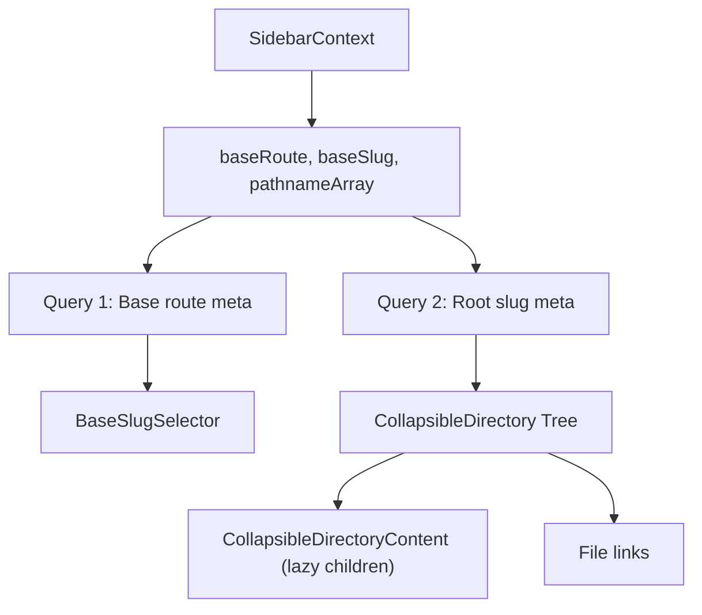

# 05 — Components

**Last Updated**: 2026-05-09

> **Note**: This documentation was generated with the assistance of AI and has been reviewed for accuracy.
> However, mistakes may exist. If you find any errors or inconsistencies, please [raise an issue](https://github.com/ThamizhiniyanCS/website/issues).

## Component Organization

```
components/
├── navbar/                        # Navigation bar
│   ├── index.tsx                  # Server component: fetches links + socials
│   └── nav-menu.tsx               # Client component: NavigationMenu UI
├── footer/
│   └── index.tsx                  # Async server component
├── sidebar/                       # Content sidebar
│   ├── index.tsx                  # SidebarContext + layout
│   ├── base-slug-selector.tsx     # Dropdown to switch base slug
│   ├── collapsible-directory.tsx  # Recursive directory tree
│   ├── collapsible-directory-content.tsx
│   └── file.tsx                   # File link item
├── search-dialog.tsx              # Pagefind search UI
├── scroll-to-top.tsx              # Scroll-to-top button
├── logo.tsx                       # Logo with light/dark variants
├── matrix-rain.jsx                # Canvas matrix rain effect
├── ui/                            # 33 shadcn/ui components
├── fumadocs-ui/files.tsx          # Fumadocs file tree
├── kibo-ui/
│   ├── image-zoom/                # react-medium-image-zoom wrapper
│   └── video-player/             # media-chrome video player
├── magic-ui/
│   ├── animated-theme-toggler.tsx # Theme toggle animation
│   └── magic-card.tsx             # Animated card effect
└── unizoy-ui/
    └── text-hover-effect.tsx      # Text hover effect
```

## Homepage Components

All homepage components are **client components** (use GSAP animations).

| Component | File | Description |
|-----------|------|-------------|
| `HeroSection` | `app/(home)/HeroSection.tsx` | GSAP-animated hero with name scramble effect, MatrixRain overlay |
| `AboutSection` | `app/(home)/AboutSection.tsx` | GSAP scroll-triggered about section |
| `SkillsSection` | `app/(home)/SkillsSection.tsx` | Skills grid with categories |
| `ProfessionalCertificationsSection` | `app/(home)/professional-certifications.tsx` | Certifications display |

## Navbar

**Server Component** (`components/navbar/index.tsx`):
- Async — directly calls `getLinks()` and `getSocials()` server actions
- Renders a fallback navbar if links fail to load
- Integrates: `NavMenu`, `SearchDialog`, `AnimatedThemeToggler`, mobile dropdown (shadcn `DropdownMenu` + `Accordion`)

**Client Component** (`components/navbar/nav-menu.tsx`):
- Uses shadcn `NavigationMenu` with mega-menu style dropdowns
- Receives `links`, `baseURL`, `cdnURL`, `socials` as props from server parent
- Desktop only (`hidden lg:flex`)

## Sidebar

**Client Component** with React Query (`components/sidebar/index.tsx`):



- **`SidebarContext`**: Provides `baseRoute`, `baseSlug`, `pathnameArray` to all children
- **`BaseSlugSelector`**: Dropdown to switch between base slugs (e.g., TryHackMe → HackTheBox)
- **`CollapsibleDirectory`**: Recursive tree with collapsible sections and lazy-loaded children
- **`variant`** prop: `"directory"` (for writeups) or `"default"` (for labs/workshops/docs)

## Search Dialog

**Client Component** (`components/search-dialog.tsx`):
- Uses `cmdk` + shadcn `Command` components
- `shouldFilter={false}` — Pagefind controls all search logic
- Category filter checkboxes derived from `BASE_ROUTES`
- Grouped results with page-level and section-level sub-results
- Keyboard shortcuts: `Ctrl+K` (open), `↑↓` (navigate), `Enter` (select), `Esc` (close)
- See [Search System](./07-search-system.md) for full details

## ScrollToTop

**Client Component** (`components/scroll-to-top.tsx`):
- Appears when user scrolls down
- Smooth scroll back to top on click

## UI Component Libraries

| Source | Components | Import Path |
|--------|-----------|-------------|
| **shadcn/ui** | 33 components (Button, Card, Dialog, Command, Tabs, Table, etc.) | `@/components/ui/*` |
| **fumadocs-ui** | File tree (`File`, `Files`, `Folder`) | `@/components/fumadocs-ui/files` |
| **kibo-ui** | ImageZoom, VideoPlayer | `@/components/kibo-ui/*` |
| **magic-ui** | AnimatedThemeToggler, MagicCard | `@/components/magic-ui/*` |
| **unizoy-ui** | TextHoverEffect | `@/components/unizoy-ui/*` |

### Installing New shadcn/ui Components

```bash
bun shadcn add <component-name>
```

Components are installed to `components/ui/`.

## Related Docs

- [MDX System](./06-mdx-system.md) — MDX-specific components
- [Animation System](./11-animation-system.md) — GSAP patterns used in components
- [Styling & Theming](./09-styling-and-theming.md) — component styling conventions
