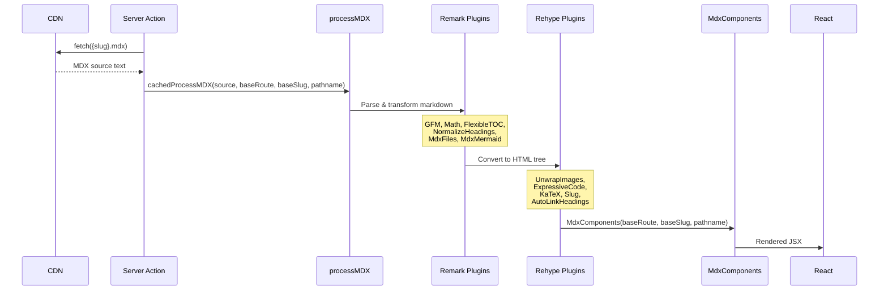

# 06 — MDX System

**Last Updated**: 2026-05-09

> **Note**: This documentation was generated with the assistance of AI and has been reviewed for accuracy.
> However, mistakes may exist. If you find any errors or inconsistencies, please [raise an issue](https://github.com/ThamizhiniyanCS/website/issues).

## Overview

MDX content is fetched from the CDN, processed through a remark/rehype plugin pipeline, and rendered as React components. The rendering uses `next-mdx-remote-client/rsc` for server-side evaluation.

## MDX Processing Pipeline



## Plugin Configuration

### Remark Plugins (Markdown → MDAST)

| Plugin | Purpose |
|--------|---------|
| `remark-flexible-toc` | Generates table of contents with `skipLevels: []` |
| `remark-gfm` | GitHub Flavored Markdown (tables, strikethrough, task lists) |
| `remark-math` | Parse LaTeX math expressions (`$...$`, `$$...$$`) |
| `remark-normalize-headings` | Normalize heading levels |
| `remarkMdxFiles` (fumadocs) | Process file references in MDX |
| `remarkMdxMermaid` (fumadocs) | Process Mermaid diagram code blocks |

### Rehype Plugins (HAST → HTML)

| Plugin | Configuration | Purpose |
|--------|--------------|---------|
| `rehype-unwrap-images` | — | Unwrap `` from `<p>` tags |
| `rehype-expressive-code` | tokyo-night theme, optional line numbers | Syntax highlighting |
| `rehype-katex` | — | Render LaTeX math to HTML |
| `rehype-slug` | — | Add `id` attributes to headings |
| `rehype-autolink-headings` | `behavior: "append"`, SVG link icon | Add anchor links to headings |

### Expressive Code Configuration

```typescript
const EXPRESSIVE_CODE_OPTIONS: RehypeExpressiveCodeOptions = {
  themes: ["tokyo-night"],
  plugins: [pluginLineNumbers()],
  defaultProps: {
    showLineNumbers: false,  // Disabled by default, enable per block
  },
}
```

## Caching Strategy

```typescript
export const cachedProcessMDX = cache(
  async (source, baseRoute, baseSlug, pathname) => {
    return processMDX(source, baseRoute, baseSlug, pathname)
  }
)
```

- Wrapped in `React.cache()` for request-level deduplication
- CDN fetches use `cache: "force-cache"` with 24hr revalidation

## MdxComponents Factory

The `MdxComponents()` function in `mdx/components/ui/index.tsx` is a factory that takes context parameters and returns component mappings:

```typescript
export default function MdxComponents(
  baseRoute: string,
  baseSlug: string,
  pathname: string
) {
  return {
    a: (props) => <LinkHoverCard ... />,
    img: (props) => <MdxImage ... />,
    table: Table,
    script: (props) => <Script {...props} strategy="lazyOnload" />,
    // ... custom components
  }
}
```

### Native HTML Overrides

| HTML Element | Replaced With | Purpose |
|-------------|---------------|---------|
| `a` | `LinkHoverCard` | OG metadata preview on hover |
| `img` | `MdxImage` | CDN URL resolution + zoom |
| `table` | shadcn `Table` | Styled table components |
| `script` | Next.js `Script` | Lazy-loaded scripts |

### Custom MDX Components

| Component | Description |
|-----------|-------------|
| `Callout`, `CalloutTitle`, `CalloutDescription`, `CalloutContent` | Admonition/callout boxes |
| `ExternalLink` | External link with arrow icon |
| `InternalLink` | Internal navigation link |
| `Mermaid` | Client-side Mermaid diagram rendering |
| `Step`, `Steps` | Numbered step-by-step instructions |
| `Video` | CDN-resolved video player (media-chrome) |
| `Accordion`, `AccordionItem`, `AccordionTrigger`, `AccordionContent` | Collapsible sections |
| `Badge` | Inline badge |
| `Button` | Interactive button |
| `Card`, `CardHeader`, `CardTitle`, `CardDescription`, `CardContent`, `CardFooter`, `CardAction` | Card layouts |
| `Carousel`, `CarouselContent`, `CarouselItem`, `CarouselNext`, `CarouselPrevious` | Image/content carousel |
| `Tabs`, `TabsList`, `TabsTrigger`, `TabsContent` | Tabbed content |
| `Table`, `TableHeader`, `TableBody`, `TableRow`, `TableHead`, `TableCell`, `TableCaption`, `TableFooter` | Data tables |
| `File`, `Files`, `Folder` | Directory structure display (fumadocs) |
| Lucide Icons | 30+ icons available directly in MDX |

### LinkHoverCard

A server component that:
1. Calls `fetchLinkMetadata()` to extract OG tags using cheerio (40KB cap)
2. Calls `canEmbedInIframe()` to check X-Frame-Options / CSP headers
3. Renders `LinkPreview` (client) with hover card showing title, description, image, and optional iframe embed

### MdxImage

Resolves relative image paths to CDN URLs:
```
./image.png → CDN_BASE_URL/{baseRoute}/{baseSlug}/{pathname}/image.png
```
Wraps images in `kibo-ui/ImageZoom` for click-to-zoom functionality.

### Video

Resolves relative video paths to CDN URLs (same pattern as images). Uses `kibo-ui/VideoPlayer` with `media-chrome` for the player UI.

## MDX Support Components

| Component | File | Purpose |
|-----------|------|---------|
| `MdxRenderer` | `mdx/components/mdx-renderer.tsx` | Renders processed MDX content |
| `MdxBreadcrumbs` | `mdx/components/mdx-breadcrumbs/` | Responsive breadcrumb navigation |
| `MdxToc` | `mdx/components/mdx-toc/` | Table of contents with scroll spy |
| `DirectoryContentsRenderer` | `mdx/components/mdx-directory-contents-renderer.tsx` | Directory listing page |
| `MdxPreviousNextButtons` | `mdx/components/mdx-previous-next-buttons.tsx` | Prev/Next navigation |
| `MdxStructuredData` | `mdx/components/mdx-structured-data.tsx` | JSON-LD structured data |
| `MdxErrorComponent` | `mdx/components/mdx-error-component.tsx` | Error display |
| `MdxLoadingComponent` | `mdx/components/mdx-loading-component.tsx` | Loading state |
| `MdxLoadingSkeleton` | `mdx/components/mdx-loading-skeleton.tsx` | Loading skeleton |

## TOC (Table of Contents)

Uses Fumadocs TOC integration with scroll spy:

| File | Description |
|------|-------------|
| `mdx-toc/index.tsx` | Main TOC component |
| `mdx-toc/clerk.tsx` | TOC clerk for scroll management |
| `mdx-toc/hooks.tsx` | Custom TOC hooks |
| `mdx-toc/mobile.tsx` | Mobile TOC variant |
| `mdx-toc/skeleton.tsx` | TOC loading skeleton |

## Related Docs

- [Content System](./03-content-system.md) — CDN structure and meta.json
- [Data Flow](./08-data-flow.md) — how MDX content is fetched
- [Components](./05-components.md) — non-MDX components
