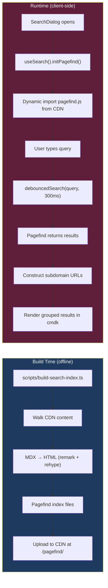

# 07 — Search System

**Last Updated**: 2026-05-09

> **Note**: This documentation was generated with the assistance of AI and has been reviewed for accuracy.
> However, mistakes may exist. If you find any errors or inconsistencies, please [raise an issue](https://github.com/ThamizhiniyanCS/website/issues).

## Overview

The search system uses [Pagefind](https://pagefind.app/) — a static search library that builds an index at build time and runs entirely client-side at runtime. The index is hosted on the CDN alongside content.

## Architecture



## Build-Time Index Generation

### Script: `scripts/build-search-index.ts`

Run with: `bun run build:search`

**Pipeline:**

1. Iterates over all `ALLOWED_SUBDOMAINS`
2. For each subdomain, fetches root `meta.json` from CDN
3. Recursively walks the content tree via `walkContent()`
4. For each file entry, fetches the MDX source
5. Converts MDX → HTML using a simplified unified pipeline:
   - `remark-parse` → `remark-frontmatter` → `remark-mdx` → `remark-gfm` → `remark-rehype` → `rehype-slug` → `rehype-stringify`
6. Wraps HTML in a Pagefind-annotated document:
   - `data-pagefind-body` — marks indexable content
   - `data-pagefind-meta` — adds `description` and `path` metadata
   - `data-pagefind-filter` — adds `category` and `subCategory` filters
7. Adds to Pagefind index via `index.addHTMLFile()`
8. Writes index files to output directory

### Pagefind HTML Template

```html
<html lang="en">
  <head>
    <title>{title}</title>
  </head>
  <body>
    <article data-pagefind-body>
      <div data-pagefind-meta="description:{description}"></div>
      <div data-pagefind-meta="path:{path}"></div>
      <div data-pagefind-filter="category:{category}"></div>
      <div data-pagefind-filter="subCategory:{subCategory}"></div>
      <h1>{title}</h1>
      {bodyHTML}
    </article>
  </body>
</html>
```

### Configuration

```typescript
const { index } = await pagefind.createIndex({
  forceLanguage: "en",
  writePlayground: false,
})
```

## Runtime: `useSearch()` Hook

**File**: `hooks/use-search.ts` (client component)

### Lifecycle

1. **Init** — Called when search dialog opens. Dynamically imports `pagefind.js` from CDN
2. **Options** — Sets `excerptLength: 20`
3. **Preload** — Pre-fetches index data for a query (called while typing)
4. **Search** — Calls `debouncedSearch(query, undefined, 300)` for 300ms debounce
5. **Results** — Maps Pagefind results to `PageSearchResult[]` with subdomain URLs

### URL Construction

Results from Pagefind contain a `path` metadata field. The hook reconstructs full subdomain URLs:

```typescript
const baseUrl = data.meta.path
  ? `${PROTOCOL}${data.filters?.category?.[0] ?? ""}.${env.NEXT_PUBLIC_DOMAIN}/${data.meta.path}`
  : data.url
```

### Return Value

```typescript
{
  results: PageSearchResult[],
  isLoading: boolean,
  isInitialized: boolean,
  search: (query: string, filters?: Record<string, string[]>) => Promise<void>,
  preload: (query: string) => Promise<void>,
  initPagefind: () => Promise<void>,
}
```

## Runtime: `SearchDialog` Component

**File**: `components/search-dialog.tsx`

### Features

- **Trigger**: Button in navbar + `Ctrl+K` keyboard shortcut
- **Search UI**: shadcn `CommandDialog` with `cmdk`
- **Filtering**: Category checkboxes for `BASE_ROUTES` (blogs, docs, labs, workshops, writeups)
- **Results**: Grouped by page, with sub-results for individual heading sections
- **Navigation**: Arrow keys navigate, Enter opens, Esc closes
- **`shouldFilter={false}`**: Critical — disables cmdk's internal filtering so Pagefind controls results

### Category Colors

```typescript
const categoryColor: Record<string, string> = {
  labs: "text-emerald-400",
  workshops: "text-blue-400",
  writeups: "text-amber-400",
  blogs: "text-rose-400",
  docs: "text-orange-500",
}
```

### Result Structure

Each page result contains:

- **Page-level result** — `FileTextIcon`, bold title
- **Section sub-results** — `HashIcon`, links to `#anchor` within the page, with excerpt snippets

## Type Definitions

**File**: `types/pagefind.type.ts`

| Type                 | Purpose                                                           |
| -------------------- | ----------------------------------------------------------------- |
| `Pagefind`           | Client API type (init, search, debouncedSearch, preload, destroy) |
| `PagefindResult`     | Single result with lazy `data()` loader                           |
| `PagefindResultData` | Loaded result with meta, filters, sub_results                     |
| `PageSearchResult`   | Processed result with constructed URLs                            |
| `SubResult`          | Individual heading match with title, url, excerpt                 |

## Rebuilding the Index

```bash
# Ensure CDN is running locally
bun run build:search

# Output: ./pagefind-output/
# Upload this directory to your CDN at: /pagefind/
```

## Related Docs

- [Content System](./03-content-system.md) — CDN content structure that gets indexed
- [Components](./05-components.md) — SearchDialog component
- [Data Flow](./08-data-flow.md) — CDN fetching patterns
