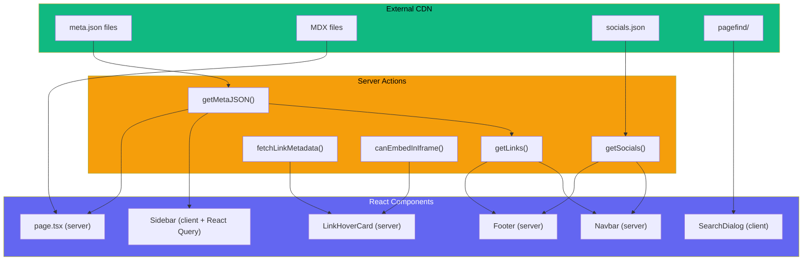
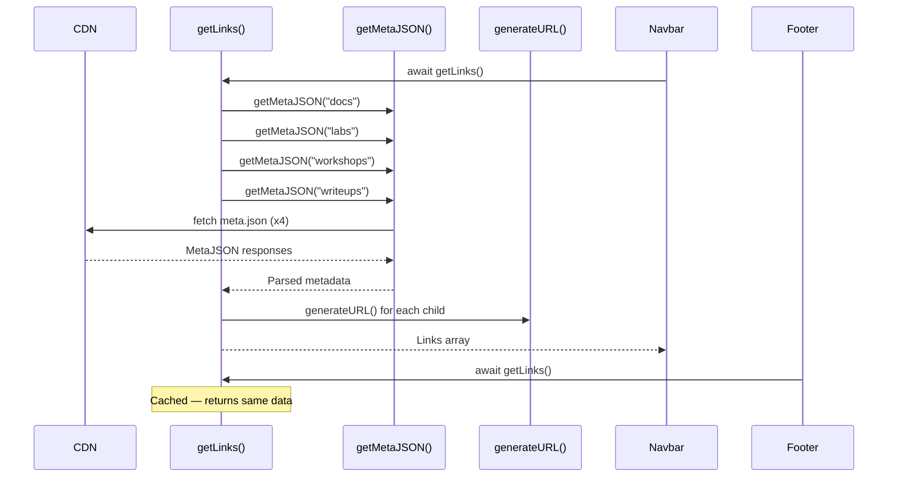

# 08 — Data Flow

**Last Updated**: 2026-05-09

> **Note**: This documentation was generated with the assistance of AI and has been reviewed for accuracy.
> However, mistakes may exist. If you find any errors or inconsistencies, please [raise an issue](https://github.com/ThamizhiniyanCS/website/issues).

## Overview

All data comes from the external CDN. Server Actions in the `actions/` directory handle all CDN fetching, with `cache: "force-cache"` and 24-hour revalidation. Client-side data fetching is limited to the sidebar (via React Query).

## Server Actions Inventory

| Action | File | Purpose | Cache |
|--------|------|---------|-------|
| `fetchFromCDN` | `actions/lib/fetch-cdn.ts` | **Generic wrapper**: handles Zod validation and CDN URL construction | `force-cache`, 24hr |
| `getMetaJSON` | `actions/get-meta-json.ts` | Fetch `meta.json` via `fetchFromCDN` | `force-cache`, 24hr |
| `getLinks` | `actions/get-links.ts` | Aggregate nav links for docs, labs, workshops, writeups | Calls `getMetaJSON` |
| `getSocials` | `actions/get-socials.ts` | Fetch `socials.json` via `fetchFromCDN` | `force-cache`, 24hr |
| `getLatestBlogs`| `actions/get-latest-blogs.ts`| Fetch latest blog cards via `fetchFromCDN` | `force-cache`, 24hr |
| `fetchLinkMetadata` | `actions/fetch-link-metadata.ts` | Extract OG metadata from any URL (cheerio) | `force-cache`, 24hr |
| `canEmbedInIframe` | `actions/can-embed-in-iframe.ts` | HEAD request to check X-Frame-Options/CSP | `force-cache`, 24hr |
| `isExternalLink` | `actions/is-external-link.ts` | Check if URL is external to the domain | No fetch |

## Data Flow Diagram



## Caching Strategy

### Route-Level Revalidation

```typescript
// app/layout.tsx and app/[baseRoute]/[baseSlug]/layout.tsx
export const revalidate = 86400 // 24 hours
```

### Fetch-Level Caching

All server action fetches use:

```typescript
fetch(url, {
  cache: "force-cache",
  next: {
    revalidate: 86400, // 24 hours
  },
})
```

### React.cache for MDX

```typescript
export const cachedProcessMDX = cache(async (...) => {
  return processMDX(...)
})
```

This prevents redundant processing within the same request (e.g., when TOC and content both need the same MDX).

## Navigation Data Flow



## `fetchLinkMetadata()` Flow

This action extracts OG metadata from external URLs for the `LinkHoverCard` component:

1. Fetches URL with 4-second timeout
2. Streams response body up to 40KB (or until `</head>` is found)
3. Parses HTML with cheerio
4. Extracts: `og:title`, `og:description`, `og:image`, `og:site_name`, `og:url`
5. Resolves relative URLs to absolute

```typescript
type LinkMetadata = {
  title: string
  description: string
  image: string | null
  site: string
  url: string
}
```

## Sidebar Data Flow (React Query)

The sidebar is the only component using client-side data fetching:

```typescript
// Two React Query queries per sidebar instance:
const baseRouteQuery = useQuery({
  queryKey: ["meta", baseRoute],
  queryFn: () => getMetaJSON(baseRoute),
})

const rootSlugQuery = useQuery({
  queryKey: ["meta", baseRoute, baseSlug],
  queryFn: () => getMetaJSON(`${baseRoute}/${baseSlug}`),
})
```

## Related Docs

- [Content System](./03-content-system.md) — CDN content structure
- [MDX System](./06-mdx-system.md) — MDX processing pipeline
- [Components](./05-components.md) — sidebar, navbar components
