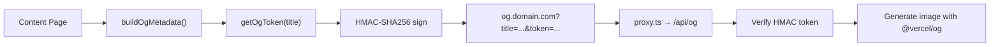

# 10 — SEO & Metadata

**Last Updated**: 2026-05-09

> **Note**: This documentation was generated with the assistance of AI and has been reviewed for accuracy.
> However, mistakes may exist. If you find any errors or inconsistencies, please [raise an issue](https://github.com/ThamizhiniyanCS/website/issues).

## Overview

Every page exports `metadata` or `generateMetadata`. The project uses dynamic OG image generation via a dedicated `og.*` subdomain with HMAC-signed tokens.

## Root Metadata

Defined in `app/layout.tsx`:

```typescript
export const metadata: Metadata = {
  title: {
    default: "Thamizhiniyan C S",
    template: `%s | Thamizhiniyan C S`,
  },
  metadataBase: new URL(BASE_URL),
  description: siteConfig.description,
  keywords: siteConfig.keywords,
  authors: siteConfig.authors,
  openGraph: { ... },
  twitter: {
    card: "summary_large_image",
    creator: "@ThamizhiniyanCS",
  },
}
```

### Site Config (`lib/config.ts`)

```typescript
export const siteConfig = {
  siteName: "Thamizhiniyan C S",
  title: "Thamizhiniyan C S | Ethical Hacker - Web Developer",
  description: "Hello, everyone. I Thamizhiniyan C S, an Ethical Hacker...",
  locale: "en_IN",
  type: "website",
  authors: [{ name: "Thamizhiniyan C S" }],
  keywords: ["Thamizhiniyan", "Cyber Security", "Next.js"],
}
```

## OG Image Generation

### Flow



### HMAC Token Generation (`utils/get-og-token.ts`)

```typescript
// Server-side only — uses OG_SECRET env var
export function getOgToken(title: string): string {
  // HMAC-SHA256(title, OG_SECRET)
}
```

### Shared OG Metadata Builder (`utils/build-og-metadata.ts`)

```typescript
export function buildOgMetadata(title: string, description: string) {
  return {
    title,
    description,
    openGraph: {
      images: [{
        url: `og.${env.NEXT_PUBLIC_DOMAIN}?title=${title}&token=${getOgToken(title)}`,
      }],
    },
  }
}
```

## Page Metadata Patterns

### Static Pages

```typescript
// app/(home)/page.tsx
export const metadata: Metadata = {
  title: "Home",
  alternates: { canonical: BASE_URL },
}
```

### Dynamic Content Pages

```typescript
// app/[baseRoute]/[baseSlug]/page.tsx
export async function generateMetadata({ params }): Promise<Metadata> {
  const { baseRoute, baseSlug } = await params
  // Fetch meta.json, build OG metadata
  return buildOgMetadata(title, description)
}
```

## Canonical URLs

Always set `alternates.canonical` using the subdomain format:

```typescript
alternates: {
  canonical: `${PROTOCOL}${baseRoute}.${env.NEXT_PUBLIC_DOMAIN}/${path}`,
}
```

## Structured Data (JSON-LD)

The `MdxStructuredData` component (`mdx/components/mdx-structured-data.tsx`) generates JSON-LD structured data for MDX content pages, embedded as a `<script type="application/ld+json">` tag.

## Sitemap (`app/sitemap.ts`)

Generates a sitemap with:
- Homepage (priority 1.0)
- All content routes with 0.9 priority scale
- Revalidates every 24 hours

## Robots (`app/robots.ts`)

Standard robots.txt configuration allowing all crawlers.

## Twitter Cards
All pages use `summary_large_image` card type with `@ThamizhiniyanCS` as creator.

## Icons & Favicons
The application uses the native Next.js App Router convention `app/icon.svg`. This file is automatically detected by Next.js, cached, and injected as a `<link>` tag into the root `<head>` with the appropriate MIME types and variants. Manual icon metadata configuration is not required in `layout.tsx`.

## Related Docs

- [Data Flow](./08-data-flow.md) — how metadata is fetched
- [Routing & Middleware](./04-routing-and-middleware.md) — OG subdomain handling
- [Environment & Config](./12-environment-and-config.md) — OG_SECRET configuration
